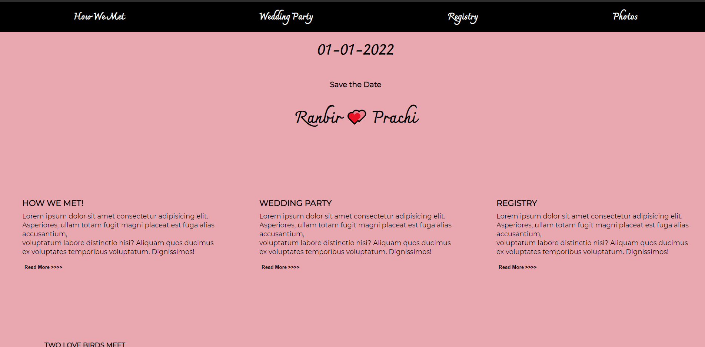

## A SIMPLE Wedding Website Landing Page  
This wedding website was built using HTML,CSS and Javascript for the Udacity Front end web development Nano degree course.

## Amazing Feautures which I have used on this website
```bash
A dynamically built Nav-Bar
```
```bash
Hamburger Menu (Mobile Screen)
```
```bash
Scroll to top button
```

## Sneak Peak 
